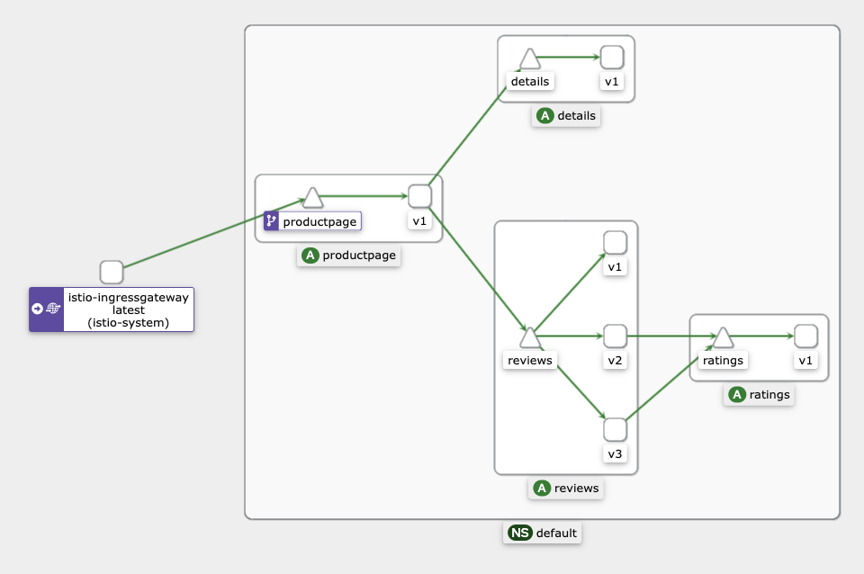

# 이스티오(Istio) 앰비언트(Ambient) 웨이포인트 프록시를 통한 사용 간편화(2023.04.26)

> **한줄 요약:** 서비스 메시를 사용할 때 가장 큰 단점이었던 사이드카의 숫자를 대폭 감소시킬 수 있는 획기적인 대안입니다.&#x20;
>
> **앰비언트 메시 소개:**
>
> * EN: [https://istio.io/latest/blog/2022/introducing-ambient-mesh/](https://istio.io/latest/blog/2022/introducing-ambient-mesh/)
> * KO: [https://sysnet4admin.gitbook.io/cncf/cloud-native/service-mesh/istio/ambient-mesh/Introducing-ambient-mesh](https://sysnet4admin.gitbook.io/cncf/cloud-native/service-mesh/istio/ambient-mesh/Introducing-ambient-mesh)
>
> **앰비언트 메시 가이드:**&#x20;
>
> &#x20; \- [https://preliminary.istio.io/latest/docs/ops/ambient/getting-started/](https://preliminary.istio.io/latest/docs/ops/ambient/getting-started/)


이 문서는 기계 번역 후에 일부 내용만 다듬었으므로, 보다 정확한 이해를 위해서는 원문을 보는 것이 좋습니다.


By Lin Sun, John Howard&#x20;

4월 26일, 2023 ([Link](https://www.cncf.io/blog/2023/04/26/istio-ambient-waypoint-proxy-made-simple/))

이 게스트 포스트는 원래 Istio의 블로그에 게시된 것으로, Solo.io의 Lin Sun과 Google의 John Howard가 작성했습니다.

단순성과 확장성을 위한 새로운 목적지 지향 웨이포인트 프록시(waypoint proxy)를 소개합니다.

Ambient는 Istio의 기능을 보안 오버레이 레이어와 레이어 7 처리 레이어라는 두 가지 레이어로 분리합니다. 웨이포인트 프록시는 Envoy 기반의 선택적 구성 요소로, 관리하는 워크로드에 대한 L7 처리를 처리합니다. 2022년에 처음 ambient가 출시([En](https://istio.io/latest/blog/2022/introducing-ambient-mesh/),[Ko](https://sysnet4admin.gitbook.io/cncf/cloud-native/service-mesh/istio/ambient-mesh/Introducing-ambient-mesh))된 이래로 웨이포인트 구성, 디버깅 기능 및 확장성을 단순화하기 위해 상당한 변경이 이루어졌습니다.


## 웨이포인트 프록시의 아키텍처&#x20;

사이드카와 마찬가지로, 웨이포인트 프록시도 Envoy 기반이며 애플리케이션 구성을 제공하도록 Istio에서 동적으로 구성합니다. 웨이포인트 프록시의 고유한 점은 네임스페이스 단위(기본값) 또는 서비스 계정 단위로 실행된다는 것입니다. 애플리케이션 파드 외부에서 실행되므로 웨이포인트 프록시는 애플리케이션과 독립적으로 설치, 업그레이드, 확장할 수 있을 뿐만 아니라 운영 비용도 절감할 수 있습니다.

<figure><figcaption><p>웨이포인트 프록시의 아키텍처</p></figcaption></figure>

웨이포인트 프록시는 쿠버네티스 게이트웨이 리소스 또는 유용한 `istioctl` 명령을 사용하여 선언적으로 배포됩니다:

```bash
$ istioctl experimental waypoint generate
apiVersion: gateway.networking.k8s.io/v1beta1
kind: Gateway
metadata:
  name: namespace
spec:
  gatewayClassName: istio-waypoint
  listeners:
  - name: mesh
    port: 15008
    protocol: HBONE
```

Istiod는 이러한 리소스를 모니터링하고 사용자를 위해 해당 웨이포인트 배포를 자동으로 배포 및 관리합니다.


## 소스 프록시 구성을 대상 프록시로 전환

기존 사이드카 아키텍처에서는 대부분의 트래픽 형성(예: 요청 라우팅 또는 트래픽 시프트 또는 장애 주입) 정책은 소스(클라이언트) 프록시에서 구현되는 반면, 대부분의 보안 정책은 대상(서버) 프록시에서 구현됩니다. 이로 인해 여러 가지 문제가 될 수 있는 지점들이 발생합니다.

* 스케일링(Scaling) - 각 소스 사이드카는 메시의 다른 모든 대상에 대한 정보를 알고 있어야 합니다. 이는 다항식 스케일링 문제입니다. 더 큰 문제는 대상 구성이 변경되면 모든 사이드카에 한꺼번에 알려야 한다는 점입니다.
* 디버깅(Debugging) - 정책 적용이 클라이언트와 서버 사이드카로 나뉘어져 있기 때문에 문제 해결 시 시스템 동작을 파악하기 어려울 수 있습니다.
* 혼합 환경(Mixed environments) - 모든 클라이언트가 메시의 일부가 아닌 시스템이 있는 경우 일관되지 않은 동작이 발생합니다. 예를 들어, 메시가 아닌 클라이언트가 카나리아 롤아웃 정책을 준수하지 않아 예기치 않은 트래픽 분산이 발생할 수 있습니다.
* 소유권 및 어트리뷰션(Ownership and attribution) - 하나의 네임스페이스에 작성된 정책은 동일한 네임스페이스에서 실행되는 프록시가 수행하는 작업에만 영향을 미치는 것이 이상적입니다. 그러나 이 모델에서는 각 사이드카에 의해 분산되고 적용됩니다. Istio는 보안을 위해 이 제약 조건을 중심으로 설계했지만 여전히 최적은 아닙니다.

Ambient에서는 모든 정책이 대상 웨이포인트에 의해 적용됩니다. 여러 가지 면에서 웨이포인트는 네임스페이스(기본 범위) 또는 서비스 계정에 대한 게이트웨이 역할을 합니다. Istio는 네임스페이스로 들어오는 모든 트래픽이 해당 네임스페이스에 대한 모든 정책을 적용하는 웨이포인트를 통과하도록 합니다. 따라서 각 웨이포인트는 자체 네임스페이스의 구성에 대해서만 알면 됩니다.

특히 확장성 문제는 대규모 클러스터에서 실행하는 사용자에게 골칫거리입니다. 이를 시각화하면 새로운 아키텍처가 얼마나 크게 개선되었는지 알 수 있습니다.

네임스페이스가 2개이고 각각 색으로 구분된 배포가 2개씩 있는 간단한 배포를 생각해 봅시다. 사이드카를 프로그래밍하는 데 필요한 Envoy(XDS) 구성은 원으로 표시되어 있습니다:

<figure><figcaption><p>모든 사이드카에는 다른 모든 사이드카에 대한 구성이 있음</p></figcaption></figure>

사이드카 모델에는 각각 4개의 구성 세트가 있는 4개의 워크로드가 있습니다. 이러한 구성 중 하나라도 변경되면 모든 구성을 업데이트해야 합니다. 총 16개의 구성이 분산되어 있습니다.

하지만 웨이포인트 아키텍처에서는 구성이 대폭 간소화됩니다:

<figure><figcaption><p>각 웨이포인트에는 자체 네임스페이스에 대한 구성만 있음</p></figcaption></figure>

여기서는 매우 다른 이야기가 있습니다. 각 웨이포인트 프록시는 전체 네임스페이스에 서비스를 제공할 수 있고, 각 웨이포인트는 자체 네임스페이스에 대한 구성만 필요하기 때문에 웨이포인트 프록시는 2개만 있습니다. 간단한 예를 들어도 총 전송되는 구성의 양은 25%에 불과합니다.

고가용성을 위해 각 네임스페이스에 각각 10개의 포드가 있는 배포를 25개까지 확장하고 각 웨이포인트 배포에 2개의 포드가 있는 경우, 아래 표에서 볼 수 있듯이 웨이포인트 구성 배포에는 사이드카 구성 배포의 0.8%만 필요하므로 그 수치는 훨씬 더 뛰어납니다!


| Config Distribution  | Namespace 1                       | Namespace 2                       | Total |
| -------------------- | --------------------------------- | --------------------------------- | ----- |
| Sidecars             | 25 configurations \* 250 sidecars | 25 configurations \* 250 sidecars | 12500 |
| Waypoints            | 25 configurations \* 2 waypoints  | 25 configurations \* 2 waypoints  | 100   |
| Waypoints / Sidecars | 0.8%                              | 0.8%                              | 0.8%  |

위의 단순화를 설명하기 위해 네임스페이스 범위의 웨이포인트 프록시를 사용했지만, 이를 서비스 계정 웨이포인트 프록시에 적용할 때도 단순화는 비슷합니다.

이렇게 구성을 줄이면 컨트롤 플레인과 데이터 플레인 모두에서 리소스 사용량(CPU, RAM 및 네트워크 대역폭)이 줄어듭니다. 현재 사용자들은 Istio 네트워킹 리소스나 사이드카 API에서 exportTo를 신중하게 사용하면 비슷한 개선 효과를 볼 수 있지만, ambient 모드에서는 더 이상 필요하지 않으므로 쉽게 확장할 수 있습니다.


## 목적지에 경유지 프록시가 없는 경우 어떻게 하나요?

주변 모드의 설계는 대부분의 구성이 서비스 소비자(consumer)가 아닌 서비스 생산자(producer)가 가장 잘 구현할 수 있다는 가정을 기반으로 합니다. 하지만 항상 그런 것은 아니며, 때로는 제어하지 않는 목적지에 대한 트래픽 관리를 구성해야 할 때도 있습니다. 예를 들어, 가끔 발생하는 연결 문제를 처리하기 위해 복원력이 향상된 외부 서비스에 연결하는 경우(예: example.com에 대한 호출에 시간 제한을 추가하는 경우)가 이에 해당하는 일반적인 예입니다.

이는 커뮤니티에서 활발히 개발 중인 영역으로, 트래픽을 송신 게이트웨이로 라우팅하는 방법과 원하는 정책으로 송신 게이트웨이를 구성하는 방법을 설계하고 있습니다. 이 영역의 향후 블로그 포스팅을 기대해주세요!


## 웨이포인트 구성에 대한 깊이 있는 분석

제어 트래픽 섹션까지 ambient 시작하기 가이드를 따랐다고 가정하고, 90%의 트래픽을 reviews v1으로, 10%의 트래픽을 reviews v2로 리디렉션하도록 bookinfo-reviews 서비스 계정에 대한 웨이포인트 프록시를 배포했다고 가정합니다.

istioctl을 사용하여 reviews 웨이포인트 프록시에 대한 리스너를 검색합니다:

```bash
$ istioctl proxy-config listener deploy/bookinfo-reviews-istio-waypoint --waypoint
LISTENER              CHAIN                                                 MATCH                                         DESTINATION
envoy://connect_originate                                                       ALL                                           Cluster: connect_originate
envoy://main_internal inbound-vip|9080||reviews.default.svc.cluster.local-http  ip=10.96.104.108 -> port=9080                 Inline Route: /*
envoy://main_internal direct-tcp                                            ip=10.244.2.14 -> ANY                         Cluster: encap
envoy://main_internal direct-tcp                                            ip=10.244.1.6 -> ANY                          Cluster: encap
envoy://main_internal direct-tcp                                            ip=10.244.2.11 -> ANY                         Cluster: encap
envoy://main_internal direct-http                                           ip=10.244.2.11 -> application-protocol='h2c'  Cluster: encap
envoy://main_internal direct-http                                           ip=10.244.2.11 -> application-protocol='http/1.1' Cluster: encap
envoy://main_internal direct-http                                           ip=10.244.2.14 -> application-protocol='http/1.1' Cluster: encap
envoy://main_internal direct-http                                           ip=10.244.2.14 -> application-protocol='h2c'  Cluster: encap
envoy://main_internal direct-http                                           ip=10.244.1.6 -> application-protocol='h2c'   Cluster: encap
envoy://main_internal direct-http                                           ip=10.244.1.6 -> application-protocol='http/1.1'  Cluster: encap
envoy://connect_terminate default                                               ALL   h
```

기본적으로 Istio의 인바운드 HBONE 포트인 포트 `15008`에 도착하는 요청의 경우, 웨이포인트 프록시는 HBONE 연결을 종료하고 요청을 `main_internal` 리스너로 전달하여 AuthorizationPolicy와 같은 워크로드 정책을 적용합니다. 내부 리스너에 익숙하지 않은 경우 시스템 네트워크 API를 사용하지 않고 사용자 공간 연결을 수락하는 Envoy 리스너입니다. 위의 `istioctl proxy-config` 명령에 추가된 `--waypoint` 플래그는 `main_internal` 수신기, 해당 필터 체인, 체인 일치 및 대상(main\_internal listener, its filter chains, chain matches, and destinations)에 대한 세부 정보를 표시하도록 지시합니다.

참고 `10.96.104.108`은 reviews의 서비스 VIP이고 `10.244.x.x`는 reviews의 v1/v2/v3 파드 IP이며, 클러스터에 대해 `kubectl get svc,pod -o wide` 명령을 사용하여 볼 수 있다. 일반 텍스트 또는 HBONE 종료 인바운드 트래픽의 경우, reviews 앱의 서비스 VIP와 포트 9080 또는 파드 IP 주소와 애플리케이션 프로토콜(`ANY`, `h2c` 또는 `http/1.1`)을 기준으로 매칭됩니다.

reviews 앱의 웨이포인트 프록시에 대한 클러스터를 확인하면, 몇 개의 인바운드 클러스터와 함께 메인\_내부 클러스터를 확인할 수 있습니다. 인프라를 위한 클러스터 외에 생성된 유일한 Envoy 클러스터는 동일한 서비스 계정에서 실행되는 서비스 및 파드용입니다. 다른 곳에서 실행 중인 서비스나 파드에 대한 클러스터는 생성되지 않습니다.

```bash
$ istioctl proxy-config clusters deploy/bookinfo-reviews-istio-waypoint
SERVICE FQDN                         PORT SUBSET  DIRECTION   TYPE         DESTINATION RULE
agent                                -    -       -           STATIC
connect_originate                    -    -       -           ORIGINAL_DST
encap                                -    -       -           STATIC
kubernetes.default.svc.cluster.local 443  tcp     inbound-vip EDS
main_internal                        -    -       -           STATIC
prometheus_stats                     -    -       -           STATIC
reviews.default.svc.cluster.local    9080 http    inbound-vip EDS
reviews.default.svc.cluster.local    9080 http/v1 inbound-vip EDS
reviews.default.svc.cluster.local    9080 http/v2 inbound-vip EDS
reviews.default.svc.cluster.local    9080 http/v3 inbound-vip EDS
sds-grpc                             -    -       -           STATIC
xds-grpc                             -    -       -           STATIC
zipkin                               -    -       -           STRICT_DNS
```

목록에 아웃바운드 클러스터가 없으며, 이는 `istioctl proxy-config cluster deploy/bookinfo-reviews-istio-waypoint --direction outbound`를 사용하여 확인할 수 있습니다! 좋은 점은 다른 책 정보 서비스(예:  `productpage` 또는 `ratings` 서비스)에서 `exportTo`를 구성할 필요가 없다는 것입니다. 즉, 별도의 수동 구성 없이도 reviews 앱의 웨이포인트가 불필요한 클러스터를 인식하지 않습니다.\
(역: 위의 앱(productpage, rating, reviews)은 모두 예제로 제공하는 [bookinfo](https://istio.io/latest/docs/examples/bookinfo/)에 관련한 내용입니다.)&#x20;

<figure><figcaption><p>bookinfo 앱의 구성</p></figcaption></figure>

`reviews` 앱의 웨이포인트 프록시에 대한 경로 목록을 표시합니다:

```bash
$ istioctl proxy-config routes deploy/bookinfo-reviews-istio-waypoint
NAME                                                    DOMAINS MATCH              VIRTUAL SERVICE
encap                                                   *       /*
inbound-vip|9080|http|reviews.default.svc.cluster.local *       /*                 reviews.default
default
```

Istio 네트워킹 리소스에서 사이드카 리소스 또는 `exportTo`구성을 구성하지 않았다는 점을 기억하세요. 그러나 제품 페이지로 라우팅하는 인그레스 게이트웨이를 구성하기 위해 bookinfo-productpage 경로를 배포했지만 reviews 웨이포인트는 이러한 관련 없는 경로를 인식하지 못했습니다.

Inbound-VIP | 9080 | http | reviews.default.svc.cluster.local 경로에 대한 자세한 정보를 표시하면 트래픽의 90%를 reviews v1으로, 10%를 reviews v2로 보내는 가중치 기반 라우팅 구성과 함께 Istio의 기본 재시도 및 시간 초과 구성 중 일부를 확인할 수 있습니다. 이렇게 하면 앞서 설명한 대로 트래픽 및 복원력 정책이 소스에서 목적지 중심의 경유지로 전환되었음을 확인할 수 있습니다.

```bash
$ istioctl proxy-config routes deploy/bookinfo-reviews-istio-waypoint --name "inbound-vip|9080|http|reviews.default.svc.cluster.local" -o yaml
- name: inbound-vip|9080|http|reviews.default.svc.cluster.local
 validateClusters: false
 virtualHosts:
 - domains:
   - '*'
   name: inbound|http|9080
   routes:
   - decorator:
       operation: reviews:9080/*
     match:
       prefix: /
     metadata:
       filterMetadata:
         istio:
           config: /apis/networking.istio.io/v1alpha3/namespaces/default/virtual-service/reviews
     route:
       maxGrpcTimeout: 0s
       retryPolicy:
         hostSelectionRetryMaxAttempts: "5"
         numRetries: 2
         retriableStatusCodes:
         - 503
         retryHostPredicate:
         - name: envoy.retry_host_predicates.previous_hosts
           typedConfig:
             '@type': type.googleapis.com/envoy.extensions.retry.host.previous_hosts.v3.PreviousHostsPredicate
         retryOn: connect-failure,refused-stream,unavailable,cancelled,retriable-status-codes
       timeout: 0s
       weightedClusters:
         clusters:
         - name: inbound-vip|9080|http/v1|reviews.default.svc.cluster.local
           weight: 90
         - name: inbound-vip|9080|http/v2|reviews.default.svc.cluster.local
           weight: 10
```

`reviews`의 웨이포인트 프록시를 위해 엔드포인트를 확인하세요.

```bash
$ istioctl proxy-config endpoints deploy/bookinfo-reviews-istio-waypoint
ENDPOINT                                            STATUS  OUTLIER CHECK CLUSTER
127.0.0.1:15000                                     HEALTHY OK            prometheus_stats
127.0.0.1:15020                                     HEALTHY OK            agent
envoy://connect_originate/                          HEALTHY OK            encap
envoy://connect_originate/10.244.1.6:9080           HEALTHY OK            inbound-vip|9080|http/v2|reviews.default.svc.cluster.local
envoy://connect_originate/10.244.1.6:9080           HEALTHY OK            inbound-vip|9080|http|reviews.default.svc.cluster.local
envoy://connect_originate/10.244.2.11:9080          HEALTHY OK            inbound-vip|9080|http/v1|reviews.default.svc.cluster.local
envoy://connect_originate/10.244.2.11:9080          HEALTHY OK            inbound-vip|9080|http|reviews.default.svc.cluster.local
envoy://connect_originate/10.244.2.14:9080          HEALTHY OK            inbound-vip|9080|http/v3|reviews.default.svc.cluster.local
envoy://connect_originate/10.244.2.14:9080          HEALTHY OK            inbound-vip|9080|http|reviews.default.svc.cluster.local
envoy://main_internal/                              HEALTHY OK            main_internal
unix://./etc/istio/proxy/XDS                        HEALTHY OK            xds-grpc
unix://./var/run/secrets/workload-spiffe-uds/socket HEALTHY OK            sds-grpc
```

기본 및 istio-system 네임스페이스에 몇 가지 다른 서비스가 있긴 하지만 reviews 이외의 서비스와 관련된 엔드포인트는 하나도 없습니다.


## 정리하기&#x20;

목적지 중심의 웨이포인트 프록시에 초점을 맞춘 웨이포인트 단순화 기능에 대해 매우 기대가 큽니다. 이는 Istio의 로드맵에서 최우선 순위인 사용성, 확장성, 디버그 가능성을 단순화하기 위한 또 다른 중요한 단계입니다. [시작 가이드](https://preliminary.istio.io/latest/docs/ops/ambient/getting-started/)를 따라 지금 바로 Ambient 알파 빌드를 사용해 보고 간소화된 웨이포인트 프록시를 경험해 보세요!


